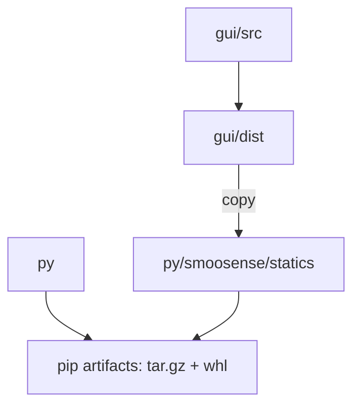

# Claude Code Development Notes

This file contains development notes and reminders for Claude when working on this project.

## Project structure

There are 2 project folders of source code:
- `smoosense-gui`: Frontend GUI
- `smoosense-py`: Python backend.

In each sub-project:
- `Makefile`: commands for builds and tests. They should implement the following targets:
    - `env`: install dependencies
    - `dev`: start the app for local development
    - `build`: build from source code
    - `test`: run all tests
- `CLAUDE.MD`: Memory file for Claude Code

Additionally:
- `docs`: Docoumentation for both Claude and developers

### Build process
The `make build-release` command in root Makefile will do the following:

