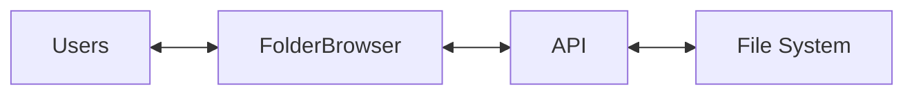
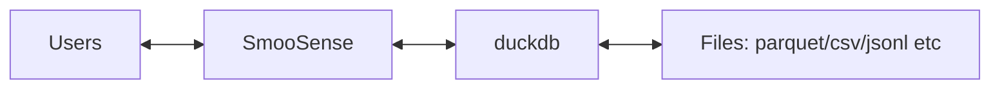
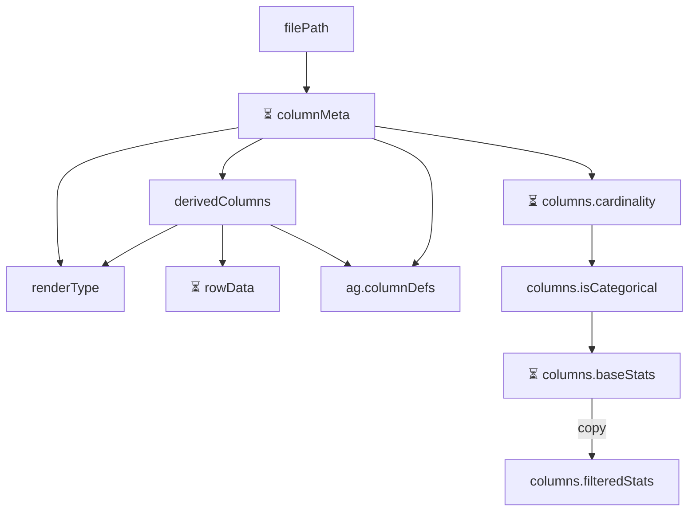

# Architecture design of SmooSense
SmooSense makes it easy to explore data and files.

There are mainly two views:
- FolderBrowser

- MainTable

## Technical design
This is a data intensive app with complicated state change, so we use [Redux](https://redux.js.org) to manage the data.

### Data slice with API call
We use [Thunks](https://redux.js.org/usage/writing-logic-thunks) to avoid duplicated requests.

Each data slice has 4 fields:
- data: the actual data
- loading: true or false, indicating if it is being loaded
- error: string or null, tracks error if any
- needRefresh: initially false. When we need to refresh a slice with an API call, we set it true.

`useAsyncData` and `createAsyncDataSlice` should be used to reduce code duplicates.

### Per-column data slice
When API calls for each column should be made independently in parallel,
we group their data slice into a dict key-ed by column name.
Each inner slice should also have fields data, loading, error and needRefresh.

## Logical design
### MainTable
Usually it is better to run analytics when it is needed, 
but we assume human attention is more expensive than machine compute time,
so we compute some stats eagerly. 

At initial load:

When a filter is applied, `columns.filteredStats` will be refreshed.

#### columnMeta
- Use `DESCRIBE` to get column names and types without loading full data file.
- If parquet file, fetch basic stats (cntAll, cntNull, min, max)
    - The min/max will be used as sample data to infer fine-grained types (url, image, video etc)
- For STRUCT columns, we flatten fields and fields of fields if they are primitive columns. 
We will run statistics and visualization for the flattened columns, while the original STRUCT column will be display as JSON. 

#### rowData
- Only fetch one page of row data at a time
- Provide sample info to users ASAP

#### cardinality
- Try to infer from columnMeta first, and then fetch if needed.
- In the query we get approximated distinct count, and only get exact distinct count when cardinality is not too big.
- If it takes too long time, very likely cardinality is too big to be considered as categorical

#### isCategorical
A column will be considered as categorical if both conditions are met:
- cardinality is low
- cntD < 5 OR (distinct ration < 10% AND cntD < 100)

#### column stats
ColStats give statistics about values in a column.
Depending on column metadata and categorical, there may be different quries:

