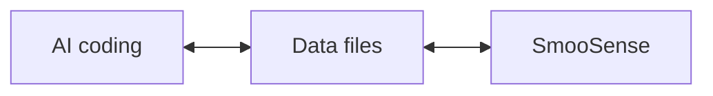

# Vibe evaluation for text-2-image GenAI

When building GenAI models or agents, one of the hardest challenges is evaluation at scale. Traditional metrics often fail to capture nuanced performance, and manual review simply doesn’t scale.

One emerging approach is to use vision-language models (VLMs) as judges, automatically scoring or flagging outputs for deeper analysis. This provides a faster feedback loop — but the raw scores alone rarely tell the full story.

That’s where SmooSense comes in. It gives you a flexible, intuitive environment for data exploration, so you can slice, dice, and visualize evaluation results in context. Instead of wrestling with scattered logs or static dashboards, you can quickly surface patterns, identify anomalies, and zoom from aggregate trends down to individual examples — all in one flow.

With SmooSense, the process of evaluating GenAI systems becomes not just scalable, but interactive and insightful.

Now let’s do a concrete, end-to-end walkthrough for evaluating text–image alignment of a GenAI model using a VLM judge + exploratory analysis.

## The data

<div style="display: flex; gap: 2rem; align-items: flex-start;">
<div style="flex: 1;">
Let's start by examining the data to be evaluated.

The data is stored in a Parquet file on S3:
```
s3://smoosense-demo/datasets/Rapidata/text-image-pair.parquet
```

It simply has two columns:
- `prompt` - the text input provided to the GenAI model
- `image_url` - the URL of the generated output image

Our goal is to use a Vision Language Model (VLM) to evaluate the alignment between each generated image and its corresponding prompt.
In other words, does the generated image faithfully reflect the prompt?

Click on the image to interactively browse the data.

</div>
<div style="flex: 1;">

<a href="https://demo.smoosense.ai/Table?tablePath=s3://smoosense-demo/datasets/Rapidata/text-image-pair.parquet&rowHeight=150" target=_blank style="display: inline-block;">

</a>

</div>
</div>


## Vibe evaluation
We provided the following prompt to Claude Code:

```markdown
Write a python script to do the following:
  - Use daft to read df from `s3://smoosense-demo/datasets/Rapidata/text-image-pair.parquet`
  - Take first 10 rows.
  - Download `image_url` and save to another column `image_bytes`
  - Define an UDF for misalignment:
      - Give `image_bytes` and `prompt` to a VLM, and expect misalignment score for each word. E.g. `[["A", 1], ["majestic", 0], ["horse", 5], ...]`
      - The higher score means the worse alignment. Range 0 to 5. 0 means perfect alignment. 5 means the opposite meaning.
      - Also give an overall misalignment_score for the prompt sentence. 
  - Save VLM response to columns `vlm_word_scores` and `vlm_misalignment_score`
  - Write output to parquet file. Do not include image_bytes.
```

Claude Code quickly generated the following script:

```python

import daft
import io
from PIL import Image
import base64
import json
import os
import requests
from anthropic import Anthropic

# Initialize Anthropic client
client = Anthropic(api_key=os.environ.get("ANTHROPIC_API_KEY"))

def download_image(url):
    """Download image from URL and return as bytes"""
    response = requests.get(url)
    response.raise_for_status()
    return response.content

def vlm_score_misalignment(image_bytes, prompt):
    """
    Use Claude Vision to analyze image-text misalignment.
    Returns a tuple: (word_scores_json, overall_score)
    """
    try:
        # Convert image bytes to base64
        image_b64 = base64.b64encode(image_bytes).decode('utf-8')

        # Determine image type
        image_type = "image/jpeg"
        try:
            img = Image.open(io.BytesIO(image_bytes))
            format_map = {
                'JPEG': 'image/jpeg',
                'PNG': 'image/png',
                'GIF': 'image/gif',
                'WEBP': 'image/webp'
            }
            image_type = format_map.get(img.format, 'image/jpeg')
        except:
            pass

        vlm_prompt = f"""Analyze the misalignment between this image and the following prompt: "{prompt}"

For each word in the prompt, assign a misalignment score from 0 to 5, where:
- 0 = perfect alignment with the image
- 1 = minor misalignment
- 2 = noticeable misalignment
- 3 = significant misalignment
- 4 = major misalignment
- 5 = opposite meaning or completely contradicts the image

Also provide an overall misalignment score (0-5) for the entire prompt sentence.

Return ONLY a valid JSON object in this exact format (no other text):
{{
  "word_scores": [["word1", score1], ["word2", score2], ...],
  "overall_score": score
}}

Example:
{{
  "word_scores": [["A", 1], ["majestic", 0], ["horse", 5], ["flying", 4]],
  "overall_score": 3.5
}}

Prompt to analyze: {prompt}"""

        message = client.messages.create(
            model="claude-sonnet-4-20250514",
            max_tokens=2048,
            messages=[
                {
                    "role": "user",
                    "content": [
                        {
                            "type": "image",
                            "source": {
                                "type": "base64",
                                "media_type": image_type,
                                "data": image_b64,
                            },
                        },
                        {
                            "type": "text",
                            "text": vlm_prompt
                        }
                    ],
                }
            ],
        )

        # Extract response
        response_text = message.content[0].text.strip()

        # Try to extract JSON if there's extra text
        if not response_text.startswith('{'):
            # Try to find JSON object in the response
            start_idx = response_text.find('{')
            end_idx = response_text.rfind('}') + 1
            if start_idx != -1 and end_idx > start_idx:
                response_text = response_text[start_idx:end_idx]

        # Parse JSON
        result = json.loads(response_text)

        # Extract word scores and overall score
        word_scores_str = json.dumps(result.get("word_scores", []))
        overall_score = result.get("overall_score", 0)

        return word_scores_str, overall_score

    except Exception as e:
        print(f"Error in VLM scoring: {e}")
        return "[]", 0

def main():
    # Read parquet from S3 using daft
    print("Reading data from S3...")
    df = daft.read_parquet("s3://smoosense-demo/datasets/Rapidata/text-image-pair.parquet")

    df = df.limit(10)

    # Convert to pandas for easier processing
    df = df.to_pandas()

    print(f"Processing {len(df)} rows")
    print(f"Columns: {df.columns.tolist()}")

    # Download images
    print("Downloading images...")
    df['image_bytes'] = df['image_url'].apply(download_image)

    # Apply VLM scoring
    print("Running VLM misalignment scoring...")
    results = df.apply(
        lambda row: vlm_score_misalignment(row['image_bytes'], row['prompt']),
        axis=1
    )

    # Unpack results into separate columns
    df['vlm_word_scores'] = results.apply(lambda x: x[0])
    df['vlm_misalignment_score'] = results.apply(lambda x: x[1])

    # Drop image_bytes and keep only required columns
    output_df = df.drop(columns=['image_bytes'])

    # Write to parquet
    output_path = "output_misalignment_scores.parquet"
    print(f"Writing output to {output_path}...")
    output_df.to_parquet(output_path, index=False)

    print("Done!")
    print(f"Output saved to: {output_path}")
    print(f"\nSample output:")
    print(output_df[['image_url', 'vlm_word_scores', 'vlm_misalignment_score']].head(3))

if __name__ == "__main__":
    main()

```
Not surprisingly, Claude Code recommended `claude-sonnet-4-20250514` as the VLM judge. 
Next we go to Anthropic console, purchased $5 token, and put the `ANTHROPIC_API_KEY` into environment variable.


## Slice-n-dice the results
Running the script will give us result


Here's a
[sample evaluation result with 100 rows](https://demo.smoosense.ai/Table?tablePath=s3://smoosense-demo/datasets/Rapidata/vlm-eval.parquet&rowHeight=150)
for your interactive exploration. BTW It roughly cost us $1 token to run 100 image-text pairs.

The table view enables several key workflows:
- Interactively adjust row height, column width, and column order to optimize comparison and analysis
- Examine score distributions, and easily filter and sort.
- View word-level misalignment scores alongside their corresponding images, to assess the performance of both the GenAI model and the VLM evaluator

Why is a reliable data explorer essential here?
- **Trust verification**: VLMs can hallucinate, so reviewing their responses is crucial for building confidence in the evaluation
- **Error detection**: We intentionally included rows where the pipeline silently failed—these anomalies become immediately visible when sorting the data
- **Seamless navigation**: Easily transition from high-level distribution analysis to individual sample inspection 

## Using SmooSense for vibe eval
SmooSense is built to be the Excel + Tableau for multimodal data — a single workspace where you can work directly with files and integrate seamlessly into your workflow.



Its key strength is flexibility. When experimenting with new models or datasets, you can prototype pipelines with AI-assisted coding, save results to files, and immediately explore them interactively — all without the overhead of complex infrastructure.

With SmooSense, iteration is fast, exploration is intuitive, and insights come with zero friction.


