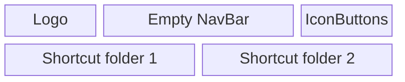
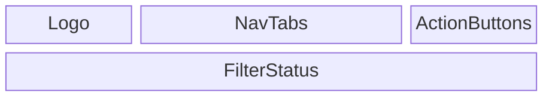
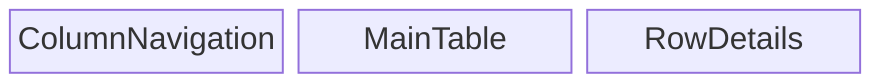
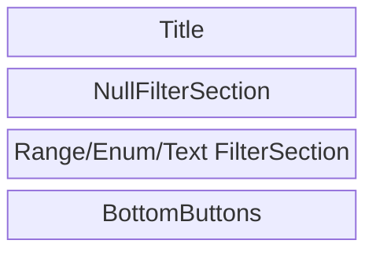
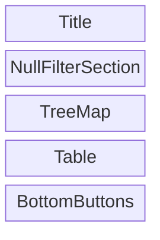
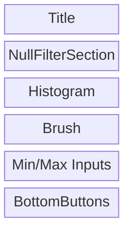
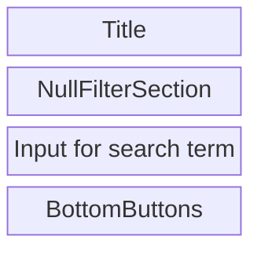
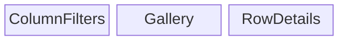
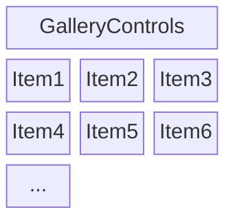

This doc is about layout design and user interaction

We have 3 routes:
- `/`: Home
- `/Table?tablePath=xxx`: browse table in a given file
- `/FolderBrowser?rootFolder=xxx`: browse folder tree structure and preview data files.

## [Route] Home
In the homepage we display several shortcuts of commonly used folders.

## [Route] Table
The NavBar is displayed on the top and controls what will be displayed in the main body.

### NavBar
There are two levels in NavBar

- Logo: clicking on the logo takes users to home page
- ActionButton:
    - Share: generate a shareable link for the current page
    - FolderBrowser: open folder browser around the give data file.
    - SQL: allows users to write and run freeform SQL query
    - Settings

### Tabs and hierarchy

- Summary: shows distributions of all columns
    - (no sub tabs)
- Samples: gives detailed view of a subset of rows
    - Table: display all-column data in an interactive table
    - Gallery: each row is displayed as a visual block
- Plots: visualizes distribution of one or multiple columns
    - BubblePlot
    - HeatMap
    - Histogram
    - BoxPlot

## [Tab] Samples/Table

### ColumnNavigation
a compact view of all column names, convenient for search columns and re-ordering. 

### MainTable
- Top row is header showing column name. Clicking a column name will toggle sorting order
- 2nd row is pinned (fixed while scrolling) HeaderStatsCell. 
    - Depending on renderType and isCategorical it may show MiniTreeMap, MiniHistogram or TextFilter
    - Clicking on the HeaderStatsCell will open the filter card
- In the table body it show one page of data

### RowDetails
shows all columns of a selected row in list view

### ColumnFilterCard

- Filter state is maintained in redux `ag.filters[columnName]`

#### EnumFilterCard

- Filter state is maintained in redux `ag.filters[columnName]`
  - `filterType` is always "myEnum"
  - `null` indicates how we want to filter null values. See details in NullFilterSection
  - `including` tracks the list of values selected.
- When redux filter is undefined, it means all included.
- When users click an item in TreeMap, the associated row in FilterTable is selected (with others unselected)
- When Apply button clicked, it save filter to redux.
- At initial rendering, FilterTable row selection should reflect the redux state.

#### RangeFilterCard

- Filter data is maintained in redux `ag.filters[columnName]`
    - `filterType` is always "myRange"
    - `null` indicates how we want to filter null values. See details in NullFilterSection
    - `range` is an array for `[min, max]`
- When users change range using brush, it will update not only the plot but also the inputs.

#### TextFilterCard

- Filter data is maintained in redux `ag.filters[columnName]`
    - `filterType` is always "myText"
    - `null` indicates how we want to filter null values. See details in NullFilterSection
    - `contains` is a string to search

#### NullFilterSection
If column metadata says there no null value or it is all null value for the column,
then we set `null` to `N/A`. 

For columns having both null and non-null values, it could be of the below:
  - `Include`: include rows where value for this column is null
  - `Exclude`: exclude rows where value for this column is null
  - `Only Null`: only show rows where value for this column is null

When users selected an enum value or set numerical range, then we automatically 
change null to `Exclude`

## [Tab] Samples/Gallery

### Gallery

GalleryControls:
- Dropdown to select `columnForGalleryVisual` from ImageUrl/VideoUrl/IFrame columns
- Dropdown to select `columnForGalleryCaption` from Text/Number columns
- Slider to adjust `visualSizeInGalleryView`, range 100 to 400, default to 200

Then it displays item in grid view. 

## Global rendering
Rules defined here apply globally.

### Crop fit for images/videos

`state.ui.cropMediaToFitCover` is used to control whether GUI should fit cover for images and videos.

- When it is true, image/video should have tailwind class `object-cover`, showing the center part.
- When it is false, image/video should have tailwind class `object-contain`, showing the whole content with reduced size.
- In either case, image/video should take full width and height of the container. The container could be table cell or gallery item.

### Playing videos
